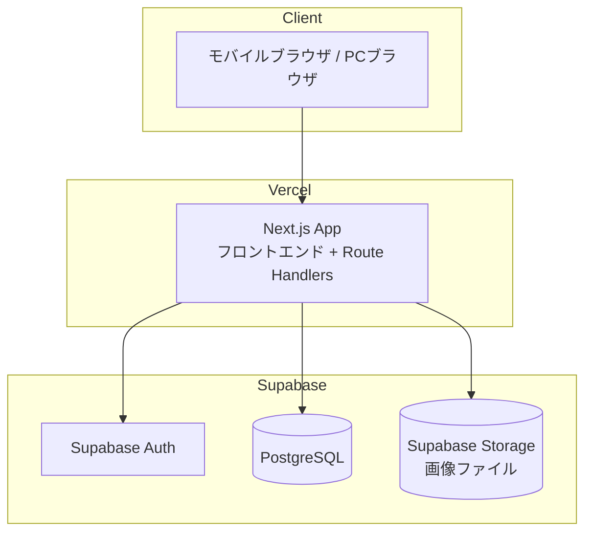

# 技術仕様書

## 1. テクノロジースタック

### フロントエンド
| 技術 | 用途 |
|------|------|
| Next.js (App Router) | フレームワーク |
| React | UIライブラリ |
| TypeScript | 言語 |
| CSS Modules | スタイリング |

### バックエンド
| 技術 | 用途 |
|------|------|
| Next.js Route Handlers | APIエンドポイント |
| Supabase Auth | 認証（メール+パスワード） |
| Supabase Database | データベース（PostgreSQL） |
| Supabase Storage | 画像ストレージ |

### インフラ
| 技術 | 用途 |
|------|------|
| Vercel | ホスティング・デプロイ |
| Supabase | BaaS（DB・認証・ストレージ） |

## 2. システム構成図

### リクエストフロー
1. ブラウザが Vercel 上の Next.js アプリにアクセス
2. Next.js の Route Handlers が API リクエストを処理
3. Supabase Auth でセッション検証
4. Supabase Database（PostgreSQL）でデータ操作
5. Supabase Storage で画像の保存・取得

## 3. 開発ツールと手法

### パッケージマネージャー
- **pnpm**

### リンター・フォーマッター
| ツール | 用途 |
|--------|------|
| ESLint | コード品質チェック |
| Prettier | コードフォーマット |

### ORM
| ツール | 用途 |
|--------|------|
| Supabase Client (@supabase/supabase-js) | DB操作・認証・ストレージアクセス |

### 画像処理
| ツール | 用途 |
|--------|------|
| sharp | サーバーサイドでの画像リサイズ・サムネイル生成・HEIC変換 |

### テスト（将来的に導入）
| ツール | 用途 |
|--------|------|
| Vitest | ユニットテスト |
| Playwright | E2Eテスト |

## 4. 技術的制約と要件

### 認証
- Supabase Auth のメール+パスワード認証を使用
- サインアップはSupabase管理画面またはシードスクリプトで行い、アプリ上にサインアップ導線は設けない
- セッション管理は Supabase Auth のトークンベース認証を利用
- Next.js の Middleware で未認証アクセスをログイン画面にリダイレクト

### 画像処理
- アップロード対応形式: JPEG, PNG, HEIC
- HEIC 画像はサーバーサイドで sharp を使い JPEG に変換してから保存
- 元画像はリサイズ・圧縮して Supabase Storage に保存
- 正方形サムネイル（中央クロップ）を自動生成し、別途保存
- Supabase Storage のアクセスポリシーで認証済みユーザーのみ画像にアクセス可能

### 環境変数
| 変数名 | 説明 |
|--------|------|
| NEXT_PUBLIC_SUPABASE_URL | Supabase プロジェクトURL |
| NEXT_PUBLIC_SUPABASE_ANON_KEY | Supabase 匿名キー |
| SUPABASE_SERVICE_ROLE_KEY | Supabase サービスロールキー（サーバーサイドのみ） |

## 5. パフォーマンス要件

| 項目 | 目標値 |
|------|--------|
| 一覧画面の初回表示 | 1秒以内 |
| 無限スクロールの追加読み込み | 500ms以内 |
| 画像アップロード（5MB以下） | 5秒以内 |
| サムネイル生成 | アップロード処理に含む |

### 最適化方針
- Next.js の Image コンポーネントによる画像最適化
- 一覧APIのカーソルベースページネーションによる効率的なデータ取得
- Supabase Storage からの画像配信（CDN経由）
