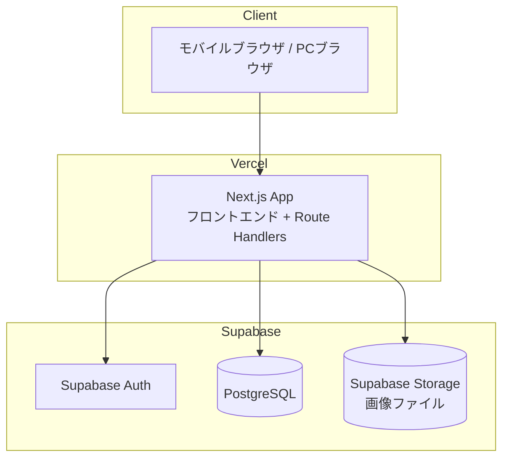
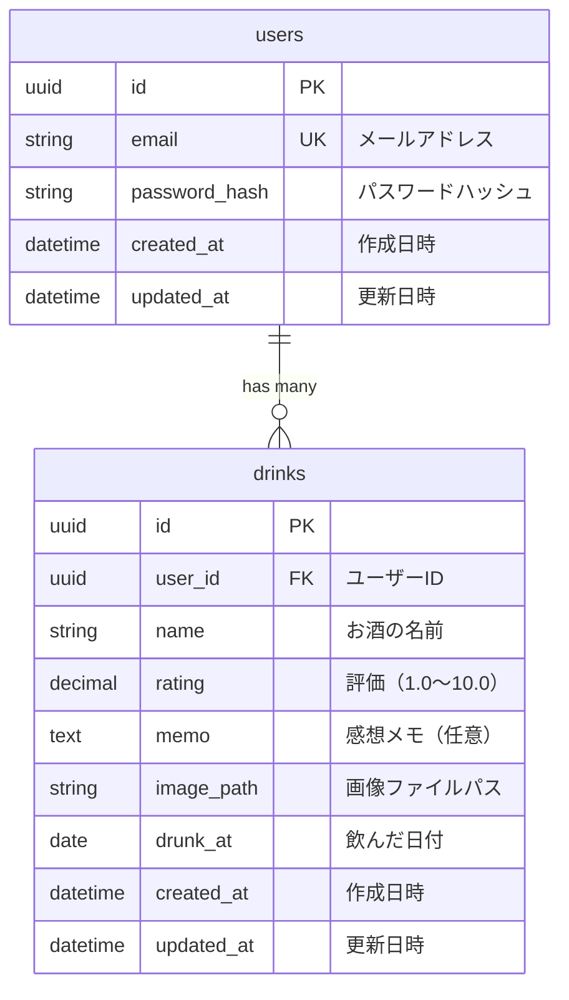
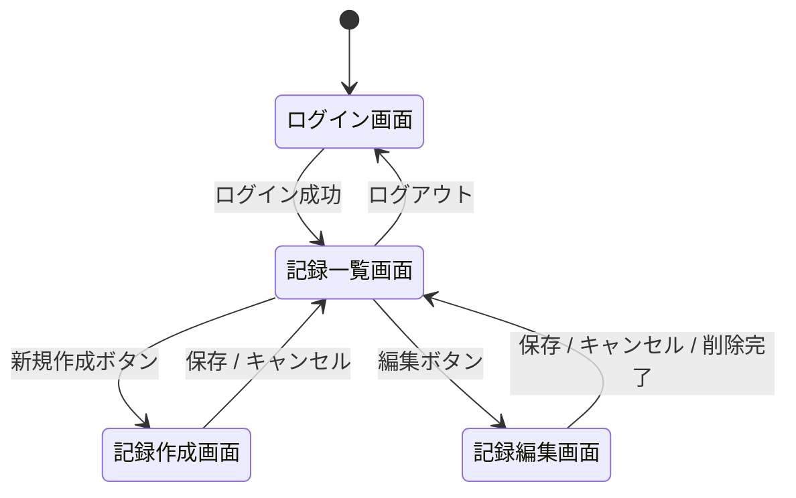

# 機能設計書

## 1. システム構成図



- **Next.js App**: Vercel上でホスティング。フロントエンドとRoute Handlers（API）を提供
- **Supabase Auth**: メール+パスワード認証、セッション管理
- **PostgreSQL**: Supabase上のデータベース。ユーザー情報・お酒の記録データを永続化
- **Supabase Storage**: アップロードされた画像ファイル（元画像・サムネイル）を保存

## 2. データモデル定義

### ER図



### テーブル定義

#### users テーブル

| カラム名 | 型 | 制約 | 説明 |
|----------|-----|------|------|
| id | UUID | PK, DEFAULT gen_random_uuid() | ユーザーID |
| email | VARCHAR(255) | UNIQUE, NOT NULL | メールアドレス |
| password_hash | VARCHAR(255) | NOT NULL | bcryptハッシュ化パスワード |
| created_at | DATETIME | NOT NULL | 作成日時 |
| updated_at | DATETIME | NOT NULL | 更新日時 |

#### drinks テーブル

| カラム名 | 型 | 制約 | 説明 |
|----------|-----|------|------|
| id | UUID | PK, DEFAULT gen_random_uuid() | 記録ID |
| user_id | UUID | FK(users.id), NOT NULL | ユーザーID |
| name | VARCHAR(255) | NOT NULL | お酒の名前 |
| rating | DECIMAL(3,1) | NOT NULL, CHECK(1.0〜10.0) | 評価 |
| memo | TEXT | NULL | 感想メモ |
| image_path | VARCHAR(500) | NULL | 画像ファイルパス |
| drunk_at | DATE | NOT NULL | 飲んだ日付 |
| created_at | DATETIME | NOT NULL | 作成日時 |
| updated_at | DATETIME | NOT NULL | 更新日時 |

**インデックス:**
- `drinks(user_id)` - ユーザーごとの記録取得
- `drinks(user_id, drunk_at)` - 日付順の一覧表示
- `drinks(user_id, name)` - 名前検索

## 3. 画面遷移図



## 4. ワイヤフレーム

### 4.1 ログイン画面

```
┌─────────────────────────┐
│                         │
│      liquor-notes       │
│                         │
│  ┌───────────────────┐  │
│  │ メールアドレス     │  │
│  └───────────────────┘  │
│  ┌───────────────────┐  │
│  │ パスワード         │  │
│  └───────────────────┘  │
│                         │
│  ┌───────────────────┐  │
│  │    ログイン        │  │
│  └───────────────────┘  │
│                         │
└─────────────────────────┘
```

### 4.2 記録一覧画面

```
┌─────────────────────────┐
│ liquor-notes    [logout] │
│─────────────────────────│
│ ┌───────────┐ [＋新規]  │
│ │🔍 名前検索 │           │
│ └───────────┘           │
│ 評価: [すべて ▼]        │
│─────────────────────────│
│ ┌───────────────────────┐│
│ │ ┌─────┐ 山崎12年[編集]││
│ │ │     │ ★ 8.5        ││
│ │ │ IMG │ 2026/02/10   ││
│ │ └─────┘              ││
│ │ 香りが華やかで、口当た ││
│ │ りがまろやか。         ││
│ └───────────────────────┘│
│ ┌───────────────────────┐│
│ │ ┌─────┐ 獺祭      [編集]││
│ │ │     │ ★ 9.0        ││
│ │ │ IMG │ 2026/02/05   ││
│ │ └─────┘              ││
│ │ フルーティーで飲みやす ││
│ │ い。                   ││
│ └───────────────────────┘│
│           ...           │
│   (無限スクロールで追加読込) │
└─────────────────────────┘
```

### 4.3 記録作成画面

```
┌─────────────────────────┐
│ ← 戻る        記録作成   │
│─────────────────────────│
│                         │
│  ┌───────────────────┐  │
│  │                   │  │
│  │   写真を選択       │  │
│  │   またはカメラ撮影  │  │
│  │                   │  │
│  └───────────────────┘  │
│                         │
│  お酒の名前 *            │
│  ┌───────────────────┐  │
│  │                   │  │
│  └───────────────────┘  │
│                         │
│  評価 *                  │
│  1.0 ──●────────── 10.0 │
│          7.5             │
│                         │
│  飲んだ日付 *             │
│  ┌───────────────────┐  │
│  │ 2026/02/15        │  │
│  └───────────────────┘  │
│                         │
│  感想メモ                │
│  ┌───────────────────┐  │
│  │                   │  │
│  │                   │  │
│  └───────────────────┘  │
│                         │
│  ┌───────────────────┐  │
│  │      保存する       │  │
│  └───────────────────┘  │
└─────────────────────────┘
```

### 4.4 記録編集画面

```
┌─────────────────────────┐
│ ← 戻る        記録編集   │
│─────────────────────────│
│                  [削除]  │
│  ┌───────────────────┐  │
│  │                   │  │
│  │   写真を選択       │  │
│  │   またはカメラ撮影  │  │
│  │                   │  │
│  └───────────────────┘  │
│                         │
│  お酒の名前 *            │
│  ┌───────────────────┐  │
│  │                   │  │
│  └───────────────────┘  │
│                         │
│  評価 *                  │
│  1.0 ──●────────── 10.0 │
│          7.5             │
│                         │
│  飲んだ日付 *             │
│  ┌───────────────────┐  │
│  │ 2026/02/15        │  │
│  └───────────────────┘  │
│                         │
│  感想メモ                │
│  ┌───────────────────┐  │
│  │                   │  │
│  │                   │  │
│  └───────────────────┘  │
│                         │
│  ┌───────────────────┐  │
│  │      保存する       │  │
│  └───────────────────┘  │
└─────────────────────────┘
```

## 5. コンポーネント設計

### 5.1 画面コンポーネント（ページ）

| コンポーネント | パス | 説明 |
|--------------|------|------|
| LoginPage | `/login` | ログイン画面 |
| DrinkListPage | `/` | 記録一覧画面（ホーム、全情報表示） |
| DrinkNewPage | `/drinks/new` | 記録作成画面 |
| DrinkEditPage | `/drinks/:id/edit` | 記録編集画面（削除もここから） |

### 5.2 共通UIコンポーネント

| コンポーネント | 説明 |
|--------------|------|
| Header | アプリヘッダー（タイトル、ログアウトボタン） |
| DrinkCard | 一覧用カード。上段左に正方形サムネイル、上段右に名前・評価・日付、下段に感想メモ、編集ボタン。サムネイルタップでオーバーレイ表示 |
| ImageOverlay | 元画像のオーバーレイ表示（サムネイルタップで開く、タップで閉じる） |
| RatingInput | 評価入力（スライダー、1.0〜10.0、0.1刻み） |
| RatingDisplay | 評価表示 |
| ImageUploader | 画像アップロード（カメラ撮影 / ファイル選択） |
| SearchBar | 名前検索バー |
| RatingFilter | 評価フィルタ |
| ConfirmDialog | 削除確認ダイアログ |

## 6. API設計

### 6.1 認証

#### POST /api/auth/login
ログイン

**リクエスト:**
```json
{
  "email": "user@example.com",
  "password": "password123"
}
```

**レスポンス（200）:**
```json
{
  "token": "eyJhbGciOiJIUzI1NiIs..."
}
```

**エラー（401）:**
```json
{
  "error": "メールアドレスまたはパスワードが正しくありません"
}
```

#### POST /api/auth/logout
ログアウト

**レスポンス（204）:** No Content

### 6.2 お酒の記録

すべてのエンドポイントは認証必須。

#### GET /api/drinks
記録一覧を取得

**クエリパラメータ:**

| パラメータ | 型 | 説明 |
|-----------|-----|------|
| q | string | 名前の部分一致検索 |
| rating_min | decimal | 評価の最小値 |
| rating_max | decimal | 評価の最大値 |
| cursor | integer | 次の取得開始位置（前回レスポンスの next_cursor） |
| limit | integer | 取得件数（デフォルト: 20） |

**レスポンス（200）:**
```json
{
  "drinks": [
    {
      "id": 1,
      "name": "山崎12年",
      "rating": 8.5,
      "memo": "香りが華やかで...",
      "image_url": "/api/images/abc123.jpg",
      "thumbnail_url": "/api/images/abc123_thumb.jpg",
      "drunk_at": "2026-02-10",
      "created_at": "2026-02-10T20:30:00Z"
    }
  ],
  "next_cursor": 21,
  "has_more": true
}
```

#### POST /api/drinks
記録を作成

**リクエスト（multipart/form-data）:**

| フィールド | 型 | 必須 | 説明 |
|-----------|-----|------|------|
| name | string | Yes | お酒の名前 |
| rating | decimal | Yes | 評価（1.0〜10.0） |
| memo | string | No | 感想メモ |
| image | file | No | 画像ファイル（JPEG/PNG/HEIC） |
| drunk_at | date | Yes | 飲んだ日付 |

**レスポンス（201）:**
```json
{
  "id": 1,
  "name": "山崎12年",
  "rating": 8.5,
  "memo": "香りが華やかで...",
  "image_url": "/api/images/abc123.jpg",
  "drunk_at": "2026-02-10",
  "created_at": "2026-02-10T20:30:00Z",
  "updated_at": "2026-02-10T20:30:00Z"
}
```

#### PUT /api/drinks/:id
記録を更新

**リクエスト（multipart/form-data）:**

| フィールド | 型 | 必須 | 説明 |
|-----------|-----|------|------|
| name | string | Yes | お酒の名前 |
| rating | decimal | Yes | 評価（1.0〜10.0） |
| memo | string | No | 感想メモ |
| image | file | No | 新しい画像（省略時は既存画像を維持） |
| drunk_at | date | Yes | 飲んだ日付 |

**レスポンス（200）:** POST /api/drinks と同じ形式

#### DELETE /api/drinks/:id
記録を削除

**レスポンス（204）:** No Content
